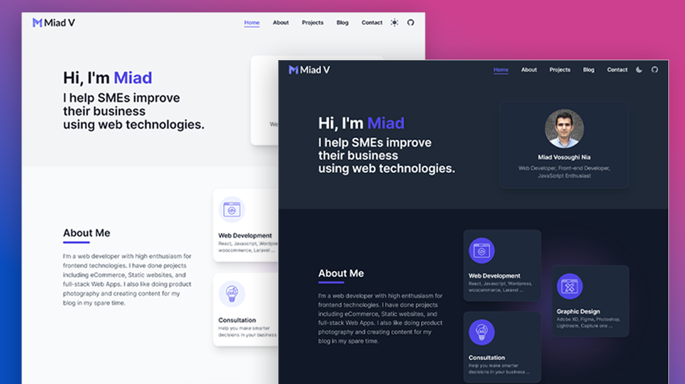

# My Portfolio / Blog

[](https://miadv.dev)

My Portfolio/Blog built using [React.js](https://reactjs.org/), [Next.js](https://nextjs.org/), [Tailwind CSS](https://tailwindcss.com/), [Typescript](https://www.typescriptlang.org/).

[**👉View Live**](https://miadv.dev)
<br />



### Folder Structure

Project directories are structured as follows:

```
root
    ├── /public
        ├── /fonts
        ├── /static
            ├── /favicons
            ├── /images
                ├── /blogs
                ├── /projects
        ├── robots.txt
    ├── /scripts
    ├── /src
        ├── /components
        ├── /hooks
        ├── /layouts
        ├── /pages
        ├── /styles
        ├── /utils
        ├── types.ts
        ├── /data
            ├── /blog
            ├── projects.js
package.json
tsconfig.json
next.config.js
postcss.config.js
tailwind.config.js
README.md
```

### Running Locally

1. Clone this reposiroty `git clone https://github.com/MiadV/miadv.dev.git`
2. Navigate to project folder and install the dependencies.

```bash
npm install
npm run dev
```

3. Create a `.env.local` file similar to `.env.example`.

Open http://localhost:3000 in your browser to see the result.

### New Blog

Bootstrap new blog frontmatter the template provided.
**New blog should be inside `/data/blog` directory.**

```
---
draft: false // if set to true it won't be accessible on website.
title: 'I am a new article'
publishedAt: '2022-01-01'
modifiedAt: '2022-01-01'
summary: "I'm the summary of the article."
image: '/static/images/blogs/new-article/banner.png' // optional
tags: ['tag-1', 'tag-2] // or empty array []
---
```

- File name will be used as post slug i.e. `new-article.mdx`.
- If you are using apostrophe ('), the sentence should be wrapped by double quotes (" ").
- Each post can have an optional banner located at `/public/static/images/blogs/{post-slug}/banner.png`.

### New Project

**New projects should be defined inside `/data/projects.js` file.**

```javascript
module.exports = [
  {...Other Projects},
  {
    id: 1, // remember to update the id
    title: 'Title ...',
    tags: ['reactjs', 'nextjs', 'typescript'],
    thumbnail: '/static/images/projects/...',
    github: 'https://github.com/MiadV/...', // optional
    youtube: 'https://youtu.be/...', // optional
    live: 'https://test.com', // optional
  },
];
```

### Cloning / Forking

Please review the [license](LICENSE) and remove all client information (logo, address, images, branding content, etc.).

### Social Media

<p align="center">
    <a href="https://www.buymeacoffee.com/miad" alt="buymeacoffee">
        
    </a>
    <a href="mailto:miadv.biz@gmail.com" alt="gmail">
    <a href="https://www.linkedin.com/in/miad-vosoughi" alt="LinkedIn">
        
    </a>
    <a href="mailto:miadv.biz@gmail.com" alt="gmail">
        
    </a>
    <a href="https://twitter.com/Miad_Vosoughi" alt="twitter">
        
    </a>
    <a href="https://www.youtube.com/c/MiadVosoughi" alt="youtube">
        
    </a>
    <a href="https://www.instagram.com/miadv.dev" alt="instagram">
        
    </a>
</p>
